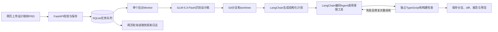

# MVP 实现方案

LangGraph 管理阶段和检查后的条件边，LangChain 负责模型适配、结构化计划、编码工具循环。代码工具只处理明确的前端文件。设计稿解析已由 GLM-5.3-Flash 多模态调用替换本机 OCR：将上传原图转换为 `design-spec.md`，提取页面区域、控件、可见状态、样式和文字，再将设计说明、PRD、仓库规范与源码交给编码阶段。识图只调用一次；不能确定的视觉细节要标明，功能以 PRD 为准，不能根据图片猜测隐藏交互。普通后端逻辑负责文件、幂等、任务队列、Git、检查和产物保存；模型不能直接决定任务成功。

编码与识图均默认使用 `glm-5.3-flash`，由当前用户的 Coding Plan API key 调用；视觉入口可通过 `VISION_BASE_URL` 独立配置，当前与编码入口一致。模型启用思考并使用低推理强度；LangChain 适配保留连续工具调用的 `reasoning_content`。识图失败停止任务，不自动重试或回退 OCR。识图成功、代码编译和生产构建通过不等于完成浏览器或视觉验收。

未使用 RAG：计划和开发读取仓库 README、文件清单及相关源码。之后扩展知识检索时，可以在计划与编码前插入检索节点，不需要重做上传与任务服务。

前端状态是后台快照的展示：queued/running/succeeded/failed 与 phase 分开，连接状态另行显示，不给虚构百分比。快照按 revision 采纳，事件按 seq 保持顺序。每轮请求结束后再安排下一次轮询，失败逐步延长间隔，终态停止轮询。

两套项目各有独立 Git 历史。CRM main 是基线；Agent 结果保留在 design-agent/<task-id> 分支及独立 worktree。默认每次都从 main 开始，完成任务不会自动合并到 main，所以多个任务不是连续叠加开发。后续需要累积功能时，应由操作者检查并明确合并结果。

初始前端设计文档中的任意仓库 URL、10 MB 图片上限、远程 PR 等设想已收敛：实际版本固定本地 CRM，图片上限为 5 MB，交付本地结果。客户数据仅使用种子演示数据和 localStorage。
