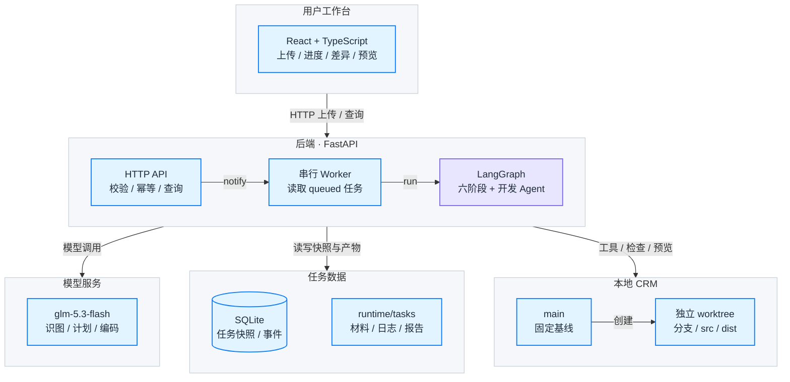
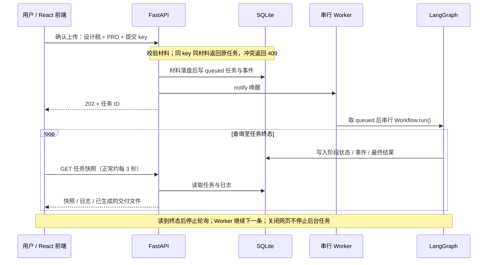
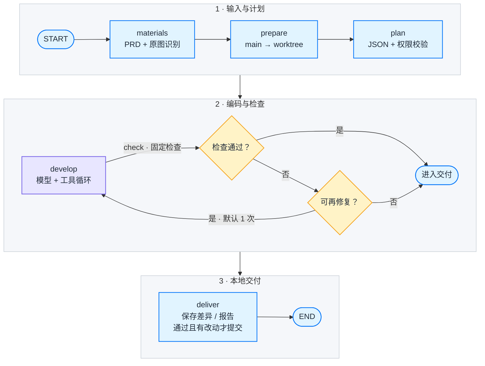
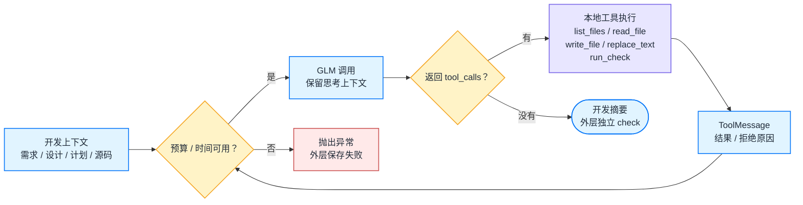
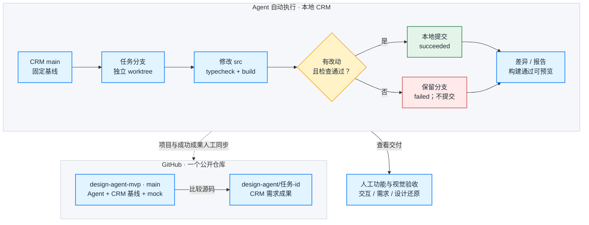

# Design Agent MVP 项目流程图

日期：2026-10-01。按当前代码整理，默认模型为 `glm-5.3-flash`。

推荐打开 [离线 HTML 展示页](flows/index.html)，默认按屏幕宽高显示一张完整图，点击菜单切换，支持缩放、下载 SVG/PNG 与打印。本文保存说明及 Mermaid 源码；GitHub 可以直接渲染代码块。

## 1. 系统长什么样

从网页、后端、模型到本地数据，先看清每一层负责什么。



- 前端通过 HTTP 提交与轮询。任务详情在 queued / running 时每 3 秒查询一次；网络失败时最多退避到 15 秒。
- 单线程 Worker 从 SQLite 按创建时间取任务；没有 Celery、Redis、向量库或 RAG。
- GLM 负责识图、规划和编码决策；文件读写、Git 与检查命令由本地代码执行。

源码：[main.py](../design-agent/backend/app/main.py)、[worker.py](../design-agent/backend/app/worker.py)、[store.py](../design-agent/backend/app/store.py)。独立矢量图：[SVG](flows/svg/01-architecture.svg)。

## 2. 一次上传如何变成后台任务

提交请求不等待模型开发结束；前端拿到任务 ID 后独立查询执行进度。



- 材料验证与任务写入发生在返回 202 之前；Worker 唤醒通知不是持久化队列，queued 状态保存在 SQLite。
- 提交响应丢失时，前端用同一提交标识查询 /api/submissions，再决定是否重试，避免重复创建任务。
- 后端重启会把原 running 任务标记 failed / interrupted，保留已有产物；queued 任务继续排队，不从中断节点恢复。

源码：[App.tsx](../design-agent/frontend/src/App.tsx)、[main.py](../design-agent/backend/app/main.py)、[worker.py](../design-agent/backend/app/worker.py)。独立矢量图：[SVG](flows/svg/02-sequence.svg)。

## 3. LangGraph 工作流怎么转

六个真实节点按三组排布；组内显示检查修复和交付判断，分组用于阅读。



- 实际节点只有 materials、prepare、plan、develop、check、deliver；图中的分组、进入交付标记和条件判断不是额外的持久化节点。
- 默认 max_repairs=1：首次检查失败后最多修复一轮，再次检查后一定进入交付。
- succeeded 只表示有源码改动且 typecheck / build 通过。浏览器功能和视觉检查在报告中仍标记 not_run。
- 任意阶段异常或预算耗尽由 Workflow.run 的外层异常处理保存错误、差异和失败报告，不自动重提任务。

源码：[workflow.py](../design-agent/backend/app/workflow.py)、[config.py](../design-agent/backend/app/config.py)。独立矢量图：[SVG](flows/svg/03-langgraph.svg)。

## 4. 模型怎样真正改动代码

这是 develop 节点内部由 LangChain create_agent 组织的循环，与外层六节点工作流分开理解。



- 模型返回工具调用请求，本地执行五种白名单工具，然后将结果作为 ToolMessage 交还模型。
- 默认预算为计划与编码合计最多 16 次模型调用；计时从 Developer 创建开始。材料识图另有一次请求与 110 秒外层超时。
- 只可读取 README 与 src；只可写 src 中的 TS / TSX / CSS。SDK 不自动重试，工具之间保留 GLM reasoning_content。

源码：[agent.py](../design-agent/backend/app/agent.py)、[models.py](../design-agent/backend/app/models.py)、[repository.py](../design-agent/backend/app/repository.py)。独立矢量图：[SVG](flows/svg/04-tool-loop.svg)。

## 5. 分支、预览与远程交付

本地 CRM 的隔离开发，与整个项目在一个 GitHub 公开仓库中的展示，是两个不同步骤。



- Agent 从 customer-manager 的固定 main 创建 worktree；依赖以本地符号链接共用，模型不能修改依赖或 Git。
- 当前后台交付只保存本地分支、差异、报告与可用预览；remote_pushed=false，不自动推送、合并或部署。
- 现有公开仓库和三个成果分支由人工整理同步。图中虚线表示人工步骤，不应介绍成 Agent 已实现的自动能力。

源码：[repository.py](../design-agent/backend/app/repository.py)、[workflow.py](../design-agent/backend/app/workflow.py)、[任务分支说明.md](../docs/任务分支说明.md)。独立矢量图：[SVG](flows/svg/05-git-delivery.svg)。

## 格式与维护

HTML 用于展示，Markdown 用于阅读和版本维护，SVG 用于放入文档与演示。HTML 已嵌入矢量图，没有运行时 CDN 依赖。

修改 `docs/flows/sources/*.mmd` 与 `diagrams.json` 后，使用独立的 [Mermaid CLI](https://github.com/mermaid-js/mermaid-cli) 重新生成；工具支持 SVG、PNG 与 PDF 渲染。

```sh
npm install --prefix .publish/diagram-tools --no-save @mermaid-js/mermaid-cli@12.0.0
python3 scripts/build-flow-docs.py --renderer .publish/diagram-tools/node_modules/.bin/mmdc
```

若使用系统 Chrome 而不下载 Puppeteer 浏览器，可为 CLI 提供 `--puppeteer-config` JSON，其中设置 `executablePath` 为本机 Chrome 路径。文档工具安装在被 Git 忽略的 `.publish/`，不会改变 Agent 的运行依赖。
